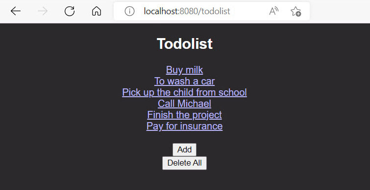

## spring-boot-todolist

### This is an example of a web "CRUD" application created using SPRING BOOT technology

***Description:***

This Spring Boot example implements a minor "CRUD" application that connects to a database, 
create, edit, and delete deeds through your operating system's browser.

***How to use:***

Create a new "database" schema in your local database (I used MySQL), 
then add your username and password in the "application.properties" configuration file. 
Also, make sure you are using the correct driver for your database. 
Create the "TodolistApplication" class run configuration in your IDE and start the Spring Boot Application. 
Open your browser with the following URL address: http://localhost:8080/todolist 
you will see the "Todolist" webpage. Start adding deeds and editing them. 
Test the functionality of the application.

***Tools used:***

Java  
Maven  
Spring Boot  
Thymeleaf  
MySQL  

